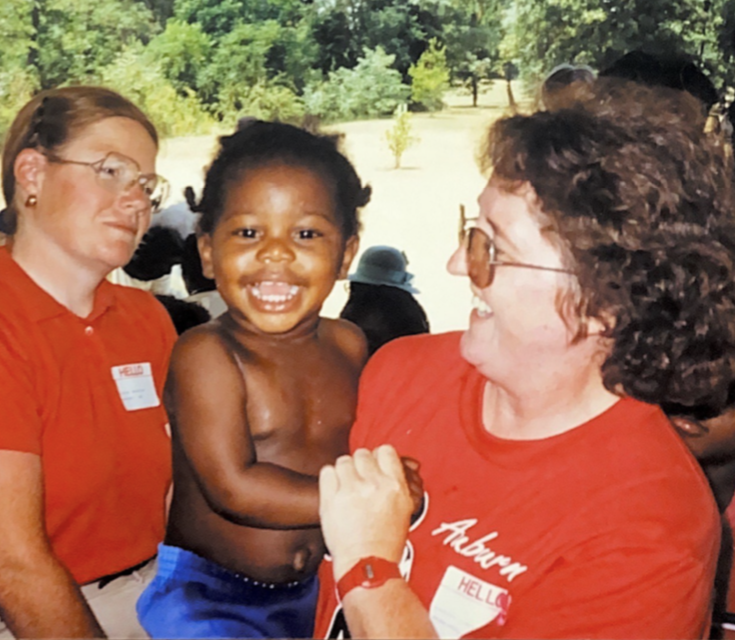
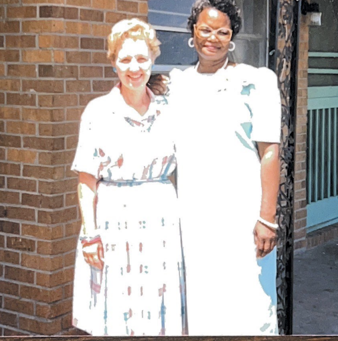
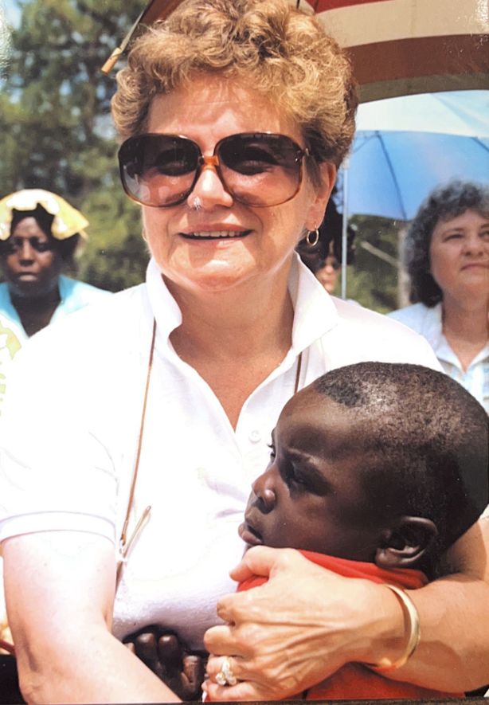
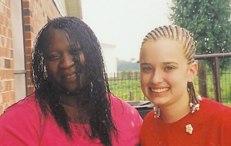
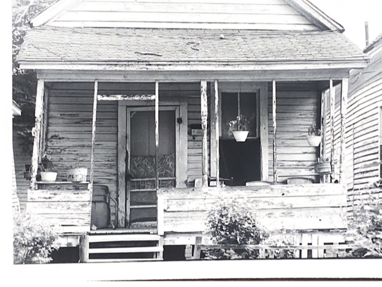
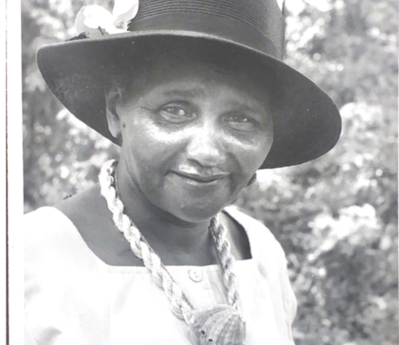

<html lang="en">
<head>
   <header>
    <a class="donate-button" href="https://your-donation-link.com">Donate</a>
</header>
   
   
   <meta charset="UTF-8">
    <meta name="viewport" content="width=device-width, initial-scale=1.0">
    <title>Image Carousel with Automatic Transitions</title>
    <link rel="stylesheet" href="styles">

    <meta charset="UTF-8">
    <meta name="viewport" content="width=device-width, initial-scale=1.0">
    <title>Your Website Title</title>
    <link rel="stylesheet" href="styles.css">
    
</head>

<body>

   
   
   
   

        

            
            
Caption for Image 2

        

        

            
            
Caption for Image 2

        

        

            
            
Caption for Image 2

        

         

            
             
Caption for Image 2

        

         

            
             
Caption for Image 2

        

         

            
             
Caption for Image 2

        

         

            
             
Caption for Image 2

        

         

            
             
Caption for Image 2

        

         

            
             
Caption for Image 2

        

         

            
             
Caption for Image 2

        

         

            
             
Caption for Image 2

        

         

            
            
Caption for Image 2

        

      
    

    <button id="prev">Previous</button>
    <button id="next">Next</button>

    
    <header>
        <h1>The Box Project</h1>
        <nav>
            <ul>
                <li><a href="#">About</a></li>
                <li><a href="#">Services</a></li>
               <li><a href="#">Contact</a></li> 
      

        The Box Project is a program of the Community Foundation of Northwest Mississippi, an accredited foundation with the Council on Foundations’ National Standards for U.S. Community Foundations. It is governed by the Community Foundation’s Board of Directors. We encourage you to investigate before you donate. Click here to read more about the Community Foundation and its finances. Click here for more information about the Box Project and its relationship to the Community Foundation of Northwest Mississippi.
      

    

  );
};

            </ul>
        </nav>
    </header>
    <main>
        <section>
            <h2>Mission</h2>
            
The Box Project offers a unique opportunity to give back. We are distinct because we create supportive, personal relationships directly between a sponsor family and a family in need living in rural America. The Box Project acts as matchmaker, pairing our “sponsor” volunteers with carefully screened individuals or families that need help. The sponsors offer long term, meaningful interactions including encouragement, advice, and boxes of needed supplies about once a month.

        </section>
        <section>
            <h2>Services</h2>
            <ul>
                <li>Service 1</li>
                <li>Service 2</li>
                <li>Service 3</li>
            </ul>
        </section>
    </main>
    <section>
        <h2>Connect with Us</h2>
        

  
  
  

        
    </section>
    <footer>
        
&copy; 2023 Your Website. All rights reserved.

    </footer>
</body>
</html>
